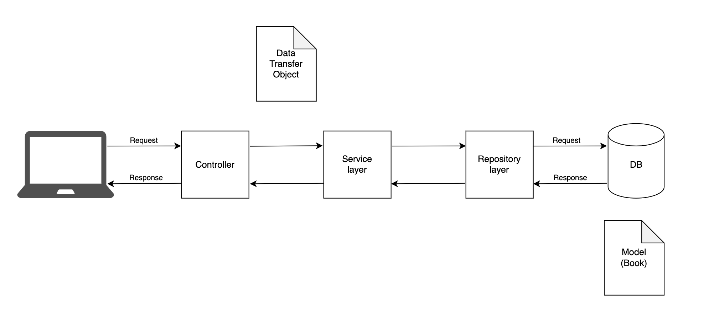

# Digital Book Journal
This is a Java Full Stack Application built using React & Spring Boot. I was inspired to do this project as reading books is 
one of my hobbies and I wanted to create a digital book journal where I could keep track of all the books I have read.
It was also an opportunity for me to learn new technologies such as SpringBoot and MongoDB which I have not used previously.

[Here](https://github.com/paulinakoz/book-store-client) is a link to the frontend application for this project, it is still a work 
in progress as at the moment it only displays a list of books and you are able to search the books by title however it does not have 
adding, updating or deleting funtionality just yet. 

[Here](Log.md) is a link to a log of my work which I updated while working on the project, where I wrote an update of what I did each 
day, any blockers I encountered and how I solved them.

## Built With 
* [![Java][Java.com]][Java-url]
* [![SpringBoot][spring.io/projects/spring-boot.com]][springboot-url]
* [![Mongodb][Mongodb.com]][Mongodb-url]

## User Stories
````
As a user,
To keep track of the books I read,
I want to be able to add them to the book journal

As a user, 
To check what books are in my book journal,
I want to be able to fetch all books

As a user,
To check if a specific book is already in the book journal,
I want to be able to search for the book by its title

As a user,
So that I have more information about the book, 
I want to see the author, description and release year

As a user,
To edit books already in the journal, 
I want to be able to update book details like the title, description or author

As a user, 
If I no longer want a book to be in the journal,
I want to be able to delete it from the list
````

## Application Architecture
* Spring boot on the backend
* React on the frontend
* MongoDB for the database
* Continuous integration using Travis CI

### Server Architecture


The backend server is a CRUD API which has GET, POST, PUT and DELETE functionality. For example, in order to display a list of books 
the frontend sends a GET request to the controller, the controller then sends the request to the service layer which deals with all the business logic 
and uses the repository layer to connect to the database and fulfil the request. The service layer also uses a data transfer object (DTO) to send the 
request back to the controller and eventually the client. I decided to use the DTO to prevent the book model from being directly exposed to the client
and to further decouple the business logic from the controller. 

## Review and Roadmap
Overall this project was realy interesting and I learned a lot of new things like building a SpringBoot application, using MongoDB and 
using continous integration with Travis CI. The toughest challenge I faced with this project was the testing since I have not previously 
tested a CRUD API built using SpringBoot. It took a lot of trial and error but eventually I managed to write passing tests for all of the
requests in the controller. 

If I was to do this project again, I would write the tests using TDD as I realise the importance of this development style. I would also add 
more tests such as testing the service layer and adding integration tests to see if the application works well as a whole. Additionally, I would add more 
functionality to the server like adding a review of the book and what I liked/disliked about it. Lastly, I would add more functionality to the frontend 
so that users can add, update and delete books using the UI. 

<!-- MARKDOWN LINKS & IMAGES -->
<!-- https://www.markdownguide.org/basic-syntax/#reference-style-links -->
[Mongodb.com]:https://img.shields.io/badge/MongoDB-4EA94B?style=for-the-badge&logo=mongodb&logoColor=white
[Mongodb-url]: https://www.mongodb.com/
[spring.io/projects/spring-boot.com]:https://img.shields.io/badge/Spring-6DB33F?style=for-the-badge&logo=spring&logoColor=white
[springboot-url]: https://spring.io/projects/spring-boot
[Java.com]:https://img.shields.io/badge/Java-ED8B00?style=for-the-badge&logo=java&logoColor=white
[Java-url]: https://www.java.com/en/